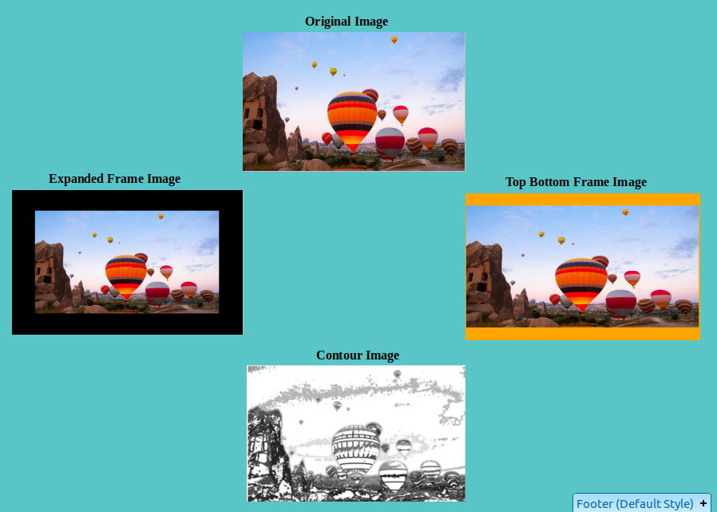
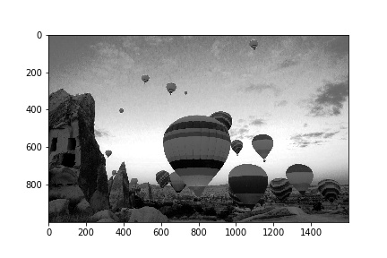
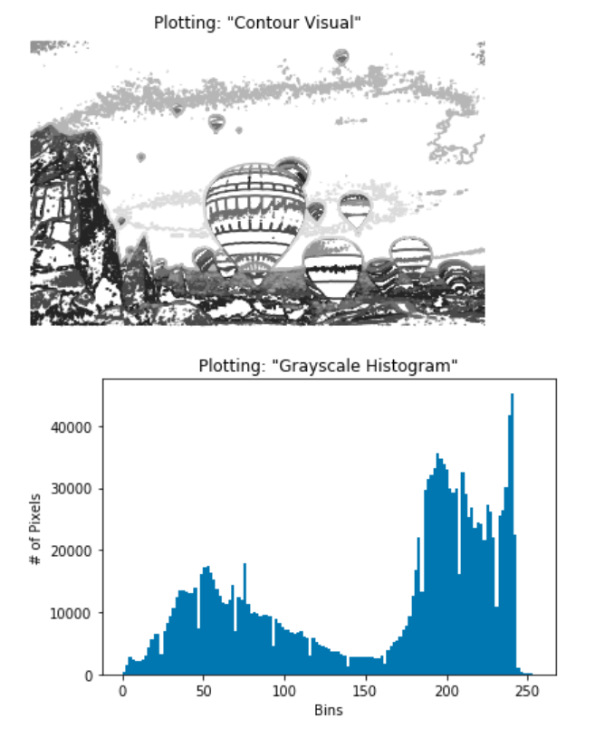

# Image-Processing-with-Pillow
Python OpenCV Pillow Image Processing Examples. Fun project.

Images can be framed, cropped and used to create a histogram.

**Framed and Contour Images**:

**Cropped Image**:

**Grayscale Image**:

**Grayscale Image**:

